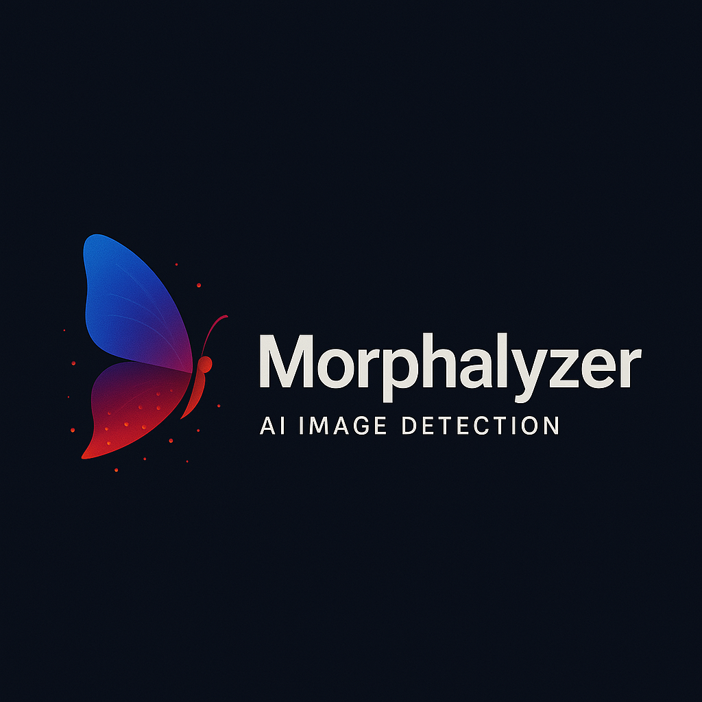

  

# Morphalyzer: Hybrid Classifier for AI-Generated Image Detection

**Morphalyzer** is a project designed to detect AI-generated images using a hybrid approach combining pixel-level CNN classifiers and file-level forensic features.

# Purpose

The accelerated advancement of generative AI models — particularly those capable of synthesizing hyper-realistic imagery — has introduced powerful creative tools, but also serious risks. Models like StyleGAN, Midjourney, and Stable Diffusion can produce facial composites and visual artworks that are indistinguishable from real content to the human eye. These images are frequently constructed using datasets scraped from public web sources, raising concerns of plagiarism, unconsented likeness reproduction, and unauthorized use of artistic style.

With the release of *4o Image Generation* by OpenAI (25 March, 2025), proliferation of such content across social media, marketplaces, and misinformation pipelines has triggered a pressing need for robust detection systems. While many current detectors focus on surface-level visual cues, adversarial improvements in diffusion models and GANs have made purely pixel-based detection brittle. At the same time, artifacts embedded at the file or compression level often remain underutilized, despite their forensic value.

**Morphalyzer** is designed in direct response to this threat landscape — leveraging both pixel-level patterns and file-level forensics in a unified model to combat the growing indistinguishability of synthetic media.

# Project Goals

**Phase 1** focuses on building a binary image classifier using pixel data. The goal is to distinguish between real and AI-generated facial images (e.g., CelebA vs. ThisPersonDoesNotExist). Later phases will incorporate non-pixel features such as metadata and byte-level compression traces. In this phase, pre-processed images will be used to train, validate and test (70/15/15) the model. Training will be done using the Adam optimizer with an inital learning rate of 0.001. This will act as the base architecture. 

**Phase 2** will attempt to fuse CNN-derived feature maps with independent file-level features to improve classification robustness. Features like EXIF/tEXt metadata, entropy, compression artifacts, and byte frequency will be extracted and encoded into a fixed-length vector and injected into intermediate layers via skip connections (Mid-layer injection, DenseNet, Dual-branch network).

**Phase 3 and 4** will interpret and validate the model's performance across multiple real-world conditions. Demo deployment for public use may be a good way to do so. Evaluation methods are tentative.

## Project Development Summary

### Phase 1: Pixel-Only CNN Classifier
Train a CNN-based binary classifier to distinguish between real and AI-generated images using pixel data alone.

### Phase 2: Hybrid Classifier (Pixel + File-Level Features)
Build a combined model that fuses CNN image embeddings with file-based forensics features to improve detection accuracy.

### Phase 3: Evaluation, Explainability, and Robustness
Evaluate the hybrid model’s performance and robustness while interpreting its predictions through Grad-CAM and feature attribution tools.

### Phase 4: Deployment & Real-World Integration
Package the hybrid detection system into a usable interface or tool for real-world testing, inference, or interactive demos.

# Data Sources & Preprocessing
This project uses a balanced dataset of 20,000 images, comprising:
- 10,000 AI-generated faces from the This Person Does Not Exist (TPDNE) dataset on Kaggle, curated by David Lorenzo.
- 10,000 real face images from the CelebA dataset (Liu et al., 2015)[^1].

[^1]: Liu, Z., Luo, P., Wang, X., & Tang, X. (2015). Deep Learning Face Attributes in the Wild. In Proceedings of the IEEE International Conference on Computer Vision (ICCV), 3730–3738.

All images were preprocessed as follows:
- Resized to 128×128 pixels using the Pillow library.
- No padding was applied; aspect ratios were preserved through center-cropping when needed, followed by resizing.
- Images were loaded and converted to RGB format to ensure consistency across both domains.

